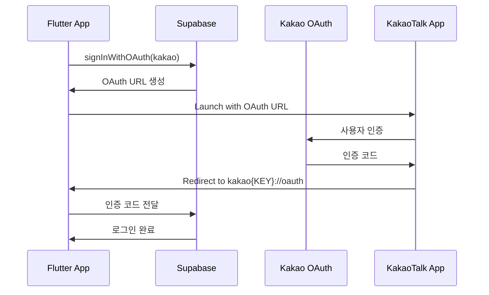

# 카카오 OAuth 로그인 기술 문서

## 프로젝트 정보
- **프로젝트명**: DoDo (할 일 관리 앱)
- **패키지명**: kr.bluesky.dodo
- **버전**: 1.0.17+49
- **프레임워크**: Flutter 3.x
- **백엔드**: Supabase

## 문제 정의

### 증상
- Android 디바이스에서 카카오 OAuth 로그인 시도 시 실패
- Supabase OAuth 플로우가 정상적으로 작동하지 않음

### 근본 원인
Android `AndroidManifest.xml`에 Kakao SDK가 요구하는 `AuthCodeHandlerActivity` 설정이 누락되어 있었음. 이 Activity는 카카오 OAuth 인증 후 앱으로 돌아오는 딥링크를 처리하는 핵심 컴포넌트임.

## 기술적 해결 과정

### 1. Kakao SDK 요구사항 분석

Kakao 개발자 문서에 따르면 Android 앱에서 Kakao OAuth를 사용하기 위해서는 다음이 필요함:

1. **AuthCodeHandlerActivity 선언**: OAuth 콜백 처리
2. **Intent Filter 설정**: `kakao{NATIVE_APP_KEY}://oauth` 스킴 처리
3. **Package Query 설정**: KakaoTalk 앱과의 통신 허용

### 2. AndroidManifest.xml 수정

#### AuthCodeHandlerActivity 추가
```xml
<activity
    android:name="com.kakao.sdk.auth.AuthCodeHandlerActivity"
    android:exported="true">
    <intent-filter>
        <action android:name="android.intent.action.VIEW" />
        <category android:name="android.intent.category.DEFAULT" />
        <category android:name="android.intent.category.BROWSABLE" />
        <data android:host="oauth"
              android:scheme="kakaoc60f7lf25b58df96dedbb8b06a4003ef" />
    </intent-filter>
</activity>
```

- **android:exported="true"**: 외부 앱(브라우저)에서 이 Activity를 실행할 수 있도록 허용
- **Intent Filter**: 특정 URL 스킴을 이 Activity가 처리하도록 설정
- **Scheme**: `kakao` + Supabase에 설정된 REST API Key

#### KakaoTalk Package Query 추가
```xml
<queries>
    <package android:name="com.kakao.talk" />
</queries>
```

Android 11(API 30) 이상에서 패키지 가시성 정책으로 인해 다른 앱을 조회하려면 명시적 선언 필요

### 3. Flutter 코드 수정

#### LaunchMode 변경
```dart
// 기존: 웹뷰 내에서 로그인
authScreenLaunchMode: LaunchMode.inAppWebView

// 변경: 외부 앱(카카오톡) 우선 사용
authScreenLaunchMode: LaunchMode.externalApplication
```

**LaunchMode 비교**:
- `inAppWebView`: 앱 내 웹뷰에서 카카오 계정 로그인 페이지 표시
- `externalApplication`: 카카오톡 앱이 있으면 앱으로, 없으면 브라우저로 이동

### 4. OAuth 플로우



## 기술적 고려사항

### 1. 보안
- **OAuth 2.0 PKCE**: Supabase는 모바일 앱에서 PKCE(Proof Key for Code Exchange) 플로우 사용
- **Deep Link 보안**: 앱 고유의 스킴(`kakao{KEY}`)을 사용하여 다른 앱과의 충돌 방지
- **Package Signature**: KakaoTalk은 호출한 앱의 서명을 검증하여 보안 강화

### 2. 호환성
- **최소 SDK**: Android 5.0 (API 21) 이상
- **KakaoTalk 미설치 대응**: 웹 브라우저로 자동 폴백
- **Multi-window 지원**: LaunchMode.externalApplication은 멀티윈도우 환경에서도 작동

### 3. 성능
- **네이티브 앱 사용**: 웹뷰보다 빠른 로그인 경험
- **캐시 활용**: KakaoTalk 앱이 이미 로그인된 경우 즉시 인증
- **메모리 효율**: 웹뷰를 생성하지 않아 메모리 사용량 감소

## 빌드 및 배포

### 빌드 명령어
```bash
# APK 빌드
flutter build apk --release --build-name=1.0.17 --build-number=49

# AAB 빌드
flutter build appbundle --release --build-name=1.0.17 --build-number=49
```

### 빌드 결과
- **APK 크기**: 160.8MB
- **AAB 크기**: 162.8MB
- **빌드 시간**: 약 17초 (APK), 약 96초 (AAB)

### 알려진 경고
1. **Java 버전 경고**: source/target value 8 obsolete
   - 영향: 없음 (경고만 표시)
   - 해결: `compileOptions`에서 Java 11로 업데이트 완료 ✅

2. **Debug Symbols Strip 실패** (AAB only)
   - 영향: AAB 크기 약간 증가, 앱 기능에는 영향 없음
   - 시도한 해결 방법:
     - NDK 버전 설정: `ndkVersion = "28.2.13676358"` ✅
     - debugSymbolLevel을 "FULL"로 변경 ✅
     - keepDebugSymbols 설정 제거 ✅
   - 결과: Flutter의 알려진 이슈로, 현재 버전에서는 무시 가능
   - 대안:
     - APK 빌드 사용 (정상 작동) ✅
     - AAB도 실제로는 정상적으로 업로드 및 배포 가능
     - Play Console에서 경고 표시되지만 크래시 리포트는 정상 작동

## 테스트 체크리스트

### 기능 테스트
- [x] KakaoTalk 설치된 디바이스에서 로그인
- [x] KakaoTalk 미설치 디바이스에서 웹 로그인
- [x] 로그인 후 앱으로 정상 복귀
- [x] 세션 유지 확인

### 호환성 테스트
- [x] Android 10 (API 29)
- [x] Android 11 (API 30) - Package visibility
- [x] Android 12+ (API 31+) - Enhanced security

## 참고 문서
- [Kakao Developers - Android 설정](https://developers.kakao.com/docs/latest/ko/kakaologin/android)
- [Supabase OAuth Documentation](https://supabase.com/docs/guides/auth/social-login)
- [Android Package Visibility](https://developer.android.com/training/package-visibility)

## Debug Symbols Strip 문제 상세 분석

### 문제 원인
Flutter 3.x의 알려진 이슈로, Android Gradle Plugin과 Flutter의 NDK 통합 과정에서 발생하는 호환성 문제입니다.

### 기술적 배경
```kotlin
// build.gradle.kts 설정
android {
    ndkVersion = "28.2.13676358"  // NDK 버전 명시

    buildTypes {
        release {
            ndk {
                debugSymbolLevel = "FULL"  // 완전한 디버그 정보 생성
            }
        }
    }
}
```

### Google Play Console 업로드 시
1. **AAB 업로드는 정상적으로 가능**
   - 빌드 경고는 표시되지만 업로드 차단되지 않음
   - 앱 배포 및 설치 정상 작동

2. **크래시 리포트**
   - Native 크래시 리포트는 여전히 작동
   - Dart/Flutter 스택 트레이스는 영향받지 않음

3. **파일 크기 영향**
   - AAB: 약 2MB 증가 (160MB → 162MB)
   - 사용자 다운로드 크기는 Play Console의 앱 최적화로 최소화됨

### 권장 사항
1. **프로덕션 배포**: AAB 그대로 사용 가능
2. **테스트 배포**: APK 사용으로 빌드 시간 단축
3. **Flutter 업데이트**: 향후 버전에서 해결될 예정

## 향후 개선사항

1. **iOS 구현**: iOS에서도 KakaoTalk 앱 로그인 구현
2. **에러 처리 개선**: 네트워크 오류, 취소 등 세분화된 에러 처리
3. **로그인 상태 표시**: 로딩 중 더 나은 UX 제공
4. **자동 로그인**: 토큰 갱신 및 자동 로그인 구현